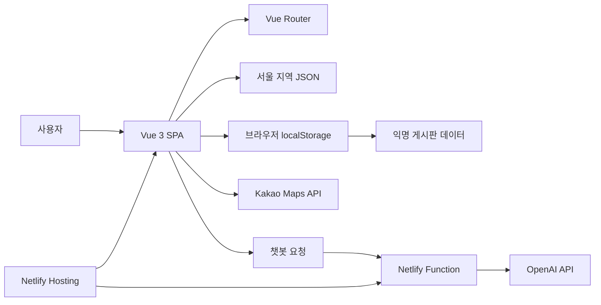

# Pin SEOUL

> 공공데이터 기반 서울 지역정보 커뮤니티  
> 관광지·맛집·축제 정보를 한곳에서 탐색하고, 익명 게시판과 AI 챗봇으로 지역 정보를 찾고 공유하는 Vue 3 기반 웹 서비스입니다.

---

## 1. 프로젝트 한눈에 보기

| 항목 | 내용 |
|---|---|
| 프로젝트명 | **Pin SEOUL** |
| 핵심 주제 | 공공데이터 기반 지역정보 탐색·공유 서비스 |
| 선정 권역 | **서울** |
| 주요 사용자 | 서울을 방문하는 관광객과 지역 주민 |
| 개발 기간 | **2026-07-14 ~ 2026-07-16** |
| 제출 마감 | **2026-07-16 15:00** |
| 내부 제출 목표 | **2026-07-16 14:30** |
| 서비스 형태 | Vue.js 3 기반 SPA(Single Page Application) |
| 데이터 저장 | 제공 JSON 파일 + 브라우저 `localStorage` |
| 배포 | Netlify |
| 소스 저장소 | SSAFY GitLab |
| 기획서 기준 현재 상태 | 요구사항 분석·MVP 확정 완료, 서울 JSON 구조 검토 진행 중 |

## 2. 프로젝트 배경

지역 주민과 관광객이 활용할 수 있는 관광지, 맛집, 축제 등의 공공데이터는 여러 파일과 서비스에 흩어져 있습니다. 사용자는 필요한 정보를 찾기 위해 여러 화면을 오가야 하고, 지역 경험이나 최신 정보를 간단히 공유할 수 있는 채널도 부족합니다.

Pin SEOUL은 서울 지역의 공공데이터를 한 화면에 모으고 다음 기능을 제공하여 이 문제를 해결합니다.

- 지도에서 관광지와 맛집 위치 확인
- 익명 커뮤니티에서 지역 정보와 경험 공유
- AI 챗봇을 통한 관광지·맛집·축제·게시글 검색
- 회원가입 없이 바로 사용할 수 있는 가벼운 사용자 경험

## 3. 프로젝트 목표와 성공 기준

### 목표

1. 제공된 서울 지역 JSON 데이터를 사용해 지역정보 서비스를 구현합니다.
2. 별도 회원가입이나 로그인 없이 이용 가능한 익명 커뮤니티를 제공합니다.
3. 제공 데이터와 게시글을 바탕으로 답변하는 AI 챗봇을 구현합니다.
4. 지도 시각화를 통해 관광지와 맛집을 직관적으로 탐색할 수 있게 합니다.
5. 3일의 개발 기간 안에 배포, 테스트, 문서화, 발표 준비까지 완료합니다.

### 성공 기준

- [ ] 필수 기능을 100% 구현
- [ ] 선택 기능을 최소 1개 이상 실제 배포
- [ ] Netlify 배포 URL에서 주요 기능이 정상 동작
- [ ] 모바일 화면에서도 게시판, 챗봇, 지도를 가능
- [ ] 데이터 출처·라이선스·수집일을 기능 명세서에 기술

## 4. 기능 범위

### 4.1 Must Have — 반드시 구현

#### 1) 서울 지역 데이터 제공

- 5개 후보 권역 중 **서울**을 최종 권역으로 사용합니다.
- 발주처가 제공한 JSON 파일을 프론트엔드에서 직접 불러옵니다.
- 별도의 공공 API 직접 호출이나 데이터베이스 서버는 사용하지 않습니다.
- 화면 구현 전 JSON의 필드, 결측값, 중복값, 좌표 형식을 먼저 확인합니다.

#### 2) 익명 커뮤니티 게시판

- 게시글 목록 조회
- 게시글 상세 조회
- 게시글 작성
- 게시글 수정
- 게시글 삭제
- 작성 시 게시글과 비밀번호를 함께 저장
- 수정·삭제 시 작성 비밀번호 일치 여부 확인
- 회원가입, 로그인, 사용자 권한 체계는 적용하지 않음
- 게시글은 브라우저 `localStorage`에 저장

> [!WARNING]
> 비밀번호를 암호화하지 않고 `localStorage`에 저장하는 방식은 교육용 요구사항에 따른 것입니다. 실제 운영 서비스에는 사용할 수 없는 구조입니다.

#### 3) AI 챗봇

- 관광지 추천
- 축제 일정 안내
- 맛집 위치 안내
- 게시글 검색 및 요약
- 대화 히스토리 유지
- 모바일 대응
- 화면 위 플로팅 버튼 형태의 챗봇 UI
- 질문과 관련된 데이터만 선별하여 모델에 전달
- API 오류, 응답 지연, 데이터 미검색 상황에 대한 예외 처리

#### 4) Vue 3 SPA

- Vue.js 3 + Vite 기반 프로젝트
- Vue Router를 활용한 화면 전환
- 별도 새로고침 없이 주요 화면 이동
- 권장 기본 화면
  - 홈
  - 게시글 목록
  - 게시글 상세
  - 게시글 작성·수정

#### 5) 배포

- Netlify에 서비스 배포
- 초기 프로젝트 단계에서 먼저 빈 프로젝트라도 배포해 배포 파이프라인 확보
- 최종 통합 후 재배포
- 배포 URL에서 홈, 게시판, 챗봇, 지도, 직접 경로 접근을 점검

### 4.2 Should Have — 현재 선택한 핵심 선택 기능

#### 지도 시각화

- Kakao Maps API 사용
- 서울 지역 관광지와 맛집을 지도 마커로 표시
- 제공 JSON의 위도·경도 데이터 재활용
- 마커 클릭 시 장소 상세정보 표시

#### 지도 필터

- 관광지·맛집 등 카테고리별 마커 필터링
- 선택한 카테고리에 해당하는 마커만 표시
- 마커 팝업에 장소명, 주소, 설명 등 제공 가능한 정보 노출

### 4.3 Could Have — 핵심 기능 완료 후 추가

#### 게시판 부가기능

- 게시글 검색
- 좋아요
- 조회수

게시판 CRUD를 재활용할 수 있어 구현 난도가 비교적 낮지만, 필수 기능과 지도 기능의 통합 테스트가 완료된 뒤에만 진행합니다.

### 4.4 Won't Have — 이번 MVP에서 제외

- 회원가입·로그인·소셜 로그인
- 사용자별 권한 관리
- 별도의 FastAPI 등 상시 백엔드 서버
- 별도의 데이터베이스 서버
- 공공 API 직접 호출
- 서울 이외 나머지 4개 권역 지원
- 축제 캘린더 전용 화면
- 데이터 대시보드
- 경로 안내
- 날씨 연동
- 다국어 지원
- 새 글 실시간 알림
- 소셜 공유

> 아이디어 평가 단계에서는 게시판 부가기능, 지도 시각화, 축제 캘린더가 모두 선정되었으나, 최종 MVP 정의서와 WBS에는 지도 기능을 우선 반영하고 축제 캘린더를 제외했습니다. 이 README는 **최종 MVP와 WBS를 기준**으로 작성되었습니다.

## 5. 핵심 사용자 흐름

### 지역정보 탐색

1. 사용자가 홈에 접속합니다.
2. 서울 지역의 주요 관광지·맛집 정보를 확인합니다.
3. 지도에서 카테고리를 선택합니다.
4. 마커를 클릭해 장소 상세정보를 확인합니다.

### 커뮤니티 이용

1. 사용자가 게시글 목록을 조회합니다.
2. 게시글을 작성하면서 수정·삭제용 비밀번호를 입력합니다.
3. 게시글은 현재 브라우저의 `localStorage`에 저장됩니다.
4. 수정·삭제 시 입력한 비밀번호와 저장된 비밀번호를 비교합니다.

### 챗봇 이용

1. 사용자가 플로팅 버튼을 눌러 챗봇을 엽니다.
2. 관광지, 맛집, 축제 또는 게시글에 대해 질문합니다.
3. 서비스는 질문과 관련된 JSON 데이터 또는 게시글만 선별합니다.
4. 선별된 정보와 질문을 AI API에 전달합니다.
5. 답변을 대화창에 표시하고 대화 흐름을 유지합니다.

## 6. 시스템 구성



### 데이터 흐름

1. 정적 지역정보는 제공 JSON에서 읽습니다.
2. 게시글은 사용자의 브라우저 `localStorage`에서 읽고 씁니다.
3. 지도는 JSON에 포함된 좌표를 Kakao Maps 마커로 변환합니다.
4. 챗봇 요청 시 전체 JSON을 그대로 보내지 않고, 질문과 관련된 항목만 선별합니다.
5. OpenAI API 키는 최종 MVP 설계에 따라 Netlify 환경변수로 관리합니다.

## 7. 기술 스택

| 구분 | 기술 | 용도 |
|---|---|---|
| Frontend | Vue.js 3 | 사용자 화면과 컴포넌트 구현 |
| Build Tool | Vite | 개발 서버 및 프로덕션 빌드 |
| Routing | Vue Router | SPA 화면 전환 |
| Static Data | JSON | 서울 관광지·맛집·축제 데이터 |
| Browser Storage | localStorage | 익명 게시글 저장 |
| Map | Kakao Maps API | 장소 마커와 지도 시각화 |
| AI | OpenAI API | 데이터 기반 질의응답 |
| Serverless | Netlify Functions | AI API 요청 중계 및 키 보호 |
| Deployment | Netlify | 웹 서비스 및 Function 배포 |
| Version Control | SSAFY GitLab | 소스코드와 산출물 관리 |
| Allowed AI Tool | VSCode Copilot | 개발 보조 도구 |

## 8. 권장 프로젝트 구조

아래 구조는 기획서의 기능 분담을 기준으로 한 권장안입니다. 실제 구현 구조와 다르면 저장소 구조에 맞게 수정합니다.

```text
localhub/
├─ public/
│  └─ data/
│     └─ seoul/
│        ├─ attractions.json
│        ├─ restaurants.json
│        └─ festivals.json
├─ src/
│  ├─ assets/
│  ├─ components/
│  │  ├─ common/
│  │  ├─ community/
│  │  ├─ chatbot/
│  │  └─ map/
│  ├─ views/
│  │  ├─ HomeView.vue
│  │  ├─ BoardListView.vue
│  │  ├─ BoardDetailView.vue
│  │  └─ BoardFormView.vue
│  ├─ router/
│  │  └─ index.js
│  ├─ services/
│  │  ├─ dataService.js
│  │  ├─ boardService.js
│  │  └─ chatService.js
│  ├─ utils/
│  ├─ App.vue
│  └─ main.js
├─ netlify/
│  └─ functions/
│     └─ chat.js
├─ .env.example
├─ .gitignore
├─ netlify.toml
├─ package.json
└─ README.md
```

## 9. 실행 방법

### 사전 준비

- Node.js와 npm이 설치되어 있어야 합니다.
- 실제 권장 Node.js 버전은 프로젝트 생성 후 `package.json` 또는 `.nvmrc`에 명시합니다.
- Kakao 개발자 키와 OpenAI API 키가 필요합니다.

### 저장소 설치

```bash
git clone <REPOSITORY_URL>
cd localhub
npm install
```

### 환경변수 설정

`.env.example`을 복사해 로컬 환경변수 파일을 만듭니다.

```env
# 브라우저에서 사용하는 지도 키 — 실제 변수명은 구현 코드와 일치시킬 것
VITE_KAKAO_MAP_APP_KEY=your_kakao_map_key

# Netlify Function에서만 사용하는 서버 환경변수
OPENAI_API_KEY=your_openai_api_key
```

> [!IMPORTANT]
> `VITE_` 접두사가 붙은 값은 프론트엔드 빌드 결과에 포함될 수 있으므로 OpenAI API 키를 `VITE_` 변수에 저장하지 않습니다. `.env` 파일은 반드시 `.gitignore`에 포함하고, 저장소에는 값이 비어 있는 `.env.example`만 공유합니다.

### 개발 서버 실행

```bash
npm run dev
```

### 프로덕션 빌드 확인

```bash
npm run build
npm run preview
```

> 실제 명령은 프로젝트의 `package.json`에 정의된 script를 기준으로 합니다.

## 10. 게시판 데이터 정책

### 필수 데이터

게시글은 최소한 다음 정보를 관리해야 합니다.

| 필드 | 설명 |
|---|---|
| 식별자 | 게시글을 구분하는 값 |
| 제목 | 게시글 제목 |
| 내용 | 게시글 본문 |
| 비밀번호 | 수정·삭제 확인용 값 |
| 작성일 | 게시글 생성 시각 |
| 수정일 | 마지막 수정 시각 |

선택 기능을 구현하는 경우 검색용 텍스트, 좋아요 수, 조회수 등을 추가할 수 있습니다.

### 주의사항

- 데이터는 작성한 브라우저와 기기에만 남습니다.
- 다른 브라우저나 다른 기기와 게시글이 동기화되지 않습니다.
- 브라우저 데이터를 삭제하면 게시글도 함께 사라질 수 있습니다.
- 발표 데모는 동일한 브라우저와 기기에서 미리 시나리오를 준비합니다.

## 11. 데이터 및 라이선스 관리

제공 JSON 이외의 데이터를 추가할 경우, 구현 전에 사용 가능 여부를 먼저 확인합니다. 기능 명세서에는 아래 항목을 반드시 기록합니다.

| 데이터 | 출처 | 라이선스·공공누리 유형 | 수집일 | 사용 기능 | 상태 |
|---|---|---|---|---|---|
| 서울 지역 제공 JSON | 발주처 제공 | **확인 필요** | **확인 필요** | 홈·지도·챗봇 | 작성 필요 |
| 추가 데이터가 있는 경우 | **기입** | **사전 확인** | **기입** | **기입** | 사용 전 검토 |

### 데이터 검토 체크리스트

- [ ] 실제 JSON 파일명과 경로를 기록했다.
- [ ] 관광지·맛집·축제별 필드 구조를 확인했다.
- [ ] 위도·경도 값의 형식과 누락 여부를 확인했다.
- [ ] 중복 장소를 확인했다.
- [ ] 빈 값 또는 비정상 값을 처리했다.
- [ ] 데이터 출처를 확인했다.
- [ ] 공공누리 유형 또는 라이선스를 확인했다.
- [ ] 데이터 수집일을 기록했다.

## 12. 역할 분담

| 담당 | 주요 작업 |
|---|---|
| **이영준** | Kakao 개발자 키·도메인 등록, 공통 레이아웃과 홈 화면, 지도 시각화, 지도 필터·상세 팝업, 발표 PPT |
| **박지우** | Vite·Vue·Router 초기 설정, `.gitignore`와 환경변수 관리, 게시판 CRUD, Netlify 초기·최종 배포, WBS 갱신 |
| **이준혁** | OpenAI 연동, 질문 관련 데이터 선별, 챗봇 UI와 대화 히스토리, 기능 명세서 작성 |
| **팀 전체** | 요구사항·MVP 확정, 서울 JSON 검토, 데이터·컴포넌트 구조 설계, 통합 테스트, 산출물 점검, 발표 리허설, 최종 제출 |

## 13. 개발 일정

### Day 1 — 2026-07-14: 기획·설계·초기 배포

- [x] 요구사항 분석 및 MVP 범위 확정
- [ ] 서울 JSON 구조 파악
- [ ] 화면 설계 검토
- [ ] Vite + Vue 3 + Router 초기 설정
- [ ] `.gitignore`에 `.env` 등록
- [ ] Kakao 개발자 키 발급 및 Netlify 도메인 등록
- [ ] 컴포넌트와 데이터 구조 설계
- [ ] 역할 분담 최종 확정
- [ ] Netlify 초기 배포 연결
- [ ] 기능 명세서와 WBS 작성 시작

### Day 2 — 2026-07-15: 핵심 기능 개발

- [ ] 공통 레이아웃과 홈 화면
- [ ] 게시판 CRUD와 비밀번호 확인 모달
- [ ] OpenAI 연동과 관련 데이터 선별
- [ ] 챗봇 플로팅 UI, 대화 히스토리, 모바일 대응
- [ ] Kakao Maps 마커 표시
- [ ] 핵심 기능 1차 통합
- [ ] 통합 테스트 시작
- [ ] 발표 PPT 작성 시작

### Day 3 — 2026-07-16: 통합·테스트·문서·발표

- [ ] 지도 필터와 마커 상세 팝업
- [ ] 여유 시 게시판 검색·좋아요·조회수
- [ ] 최종 통합과 버그 수정
- [ ] Netlify 최종 재배포
- [ ] 모바일 포함 전체 기능 테스트
- [ ] `.env` 미포함 확인
- [ ] 데이터 출처·라이선스 목록 확인
- [ ] 기능 명세서, WBS, PPT 최종화
- [ ] 발표 리허설과 데모 동선 점검
- [ ] 14:30까지 산출물 제출

## 14. 테스트 체크리스트

### 홈·라우팅

- [ ] 홈 화면이 정상적으로 렌더링된다.
- [ ] 게시판 목록·상세·작성 화면으로 이동할 수 있다.
- [ ] 직접 URL 접근과 새로고침 시 화면이 깨지지 않는다.
- [ ] 모바일 너비에서 레이아웃이 겹치지 않는다.

### 커뮤니티

- [ ] 게시글을 작성할 수 있음
- [ ] 새로고침 후에도 같은 브라우저에서 게시글이 유지
- [ ] 목록에서 게시글 상세 화면으로 이동할 수 있음
- [ ] 올바른 비밀번호로 게시글을 수정할 수 있음
- [ ] 잘못된 비밀번호로는 수정할 수 없음
- [ ] 올바른 비밀번호로 게시글을 삭제할 수 있음
- [ ] 빈 제목·내용 등 잘못된 입력을 방지

### 챗봇

- [ ] 플로팅 버튼으로 챗봇을 열고 닫을 수 있음
- [ ] 관광지 질문에 제공 데이터 기반 답변을 가능
- [ ] 맛집 위치 질문에 관련 장소를 안내
- [ ] 축제 일정 질문에 데이터가 있는 범위에서 답변
- [ ] 게시글 검색 질문에 관련 게시글을 찾음
- [ ] 대화 히스토리가 유지
- [ ] API 오류 시 사용자에게 이해할 수 있는 메시지를 표시
- [ ] 관련 데이터가 없을 때 임의로 정보를 만들지 않도록 안내
- [ ] 응답 길이와 호출 횟수가 비용 한도를 넘지 않도록 제한

### 지도

- [ ] Kakao 지도가 정상적으로 표시
- [ ] 관광지와 맛집 마커가 올바른 위치에 나타남
- [ ] 좌표가 없는 데이터는 안전하게 제외
- [ ] 카테고리 필터가 정상 동작
- [ ] 마커 클릭 시 상세정보가 표시
- [ ] 모바일 화면에서 지도를 조작할 수 있음

### 배포·보안·산출물

- [ ] `.env` 파일이 Git에 포함되지 않음
- [ ] OpenAI API 키가 프론트엔드 코드에 직접 노출되지 않음
- [ ] API 사용량과 결제 한도가 설정
- [ ] Netlify 배포 URL에서 전체 기능이 동작
- [ ] 기능 명세서에 데이터 출처·라이선스·수집일

## 15. 제출 산출물

- [ ] SSAFY GitLab 소스코드 저장소 URL
- [ ] Netlify 배포 URL
- [ ] 기능 명세서
  - [ ] 기능 목록
  - [ ] 데이터 출처
  - [ ] 라이선스·공공누리 유형
  - [ ] 데이터 수집일
- [ ] WBS와 일정표
- [ ] 발표 PPT

### 프로젝트 링크

| 구분 | 링크 |
|---|---|
| GitLab 저장소 | `TBD` |
| Netlify 배포 사이트 | `TBD` |
| 기능 명세서 | `TBD` |
| 발표 자료 | `TBD` |

## 16. 개발 제약사항

- 개발 보조 도구는 **VSCode Copilot + OpenAI API** 조합만 사용합니다.
- Claude Code, Codex, Cursor 등 허용되지 않은 도구를 사용하지 않습니다.
- 제공된 API 키의 비용 한도를 초과하지 않습니다.
- 추가 데이터는 사용 전에 라이선스를 확인합니다.
- `.env` 파일을 Git 저장소에 포함하지 않습니다.
- 인증 체계를 임의로 추가하지 않습니다.
- 기능을 늘리기 전에 Must Have 기능의 동작 여부를 먼저 확인합니다.
- 산출물 하나라도 누락되지 않도록 제출 전 팀 전체가 교차 점검합니다.

## 17. 보안과 한계

### 보안상 주의

- 익명 게시판 비밀번호는 교육용 요구사항에 따라 암호화하지 않습니다.
- 게시판에 개인정보나 민감정보를 작성하지 않도록 안내해야 합니다.
- OpenAI API 키는 클라이언트 코드가 아닌 Netlify 환경변수에 저장하는 것을 최종 구현 기준으로 합니다.
- Kakao 지도 키는 허용 도메인을 Netlify 배포 주소로 제한합니다.
- API 사용량 제한과 결제 한도를 낮게 설정합니다.

### 구조적 한계

- `localStorage` 데이터는 브라우저·기기 간 공유되지 않습니다.
- 여러 사용자가 같은 게시판 데이터를 실시간으로 볼 수 없습니다.
- 브라우저 저장공간을 삭제하면 게시글이 사라질 수 있습니다.
- 정적 JSON이 갱신되지 않으면 최신 지역정보를 반영하지 못합니다.
- 별도 인증·서버·DB가 없으므로 실제 운영 서비스 수준의 보안과 동기화를 제공하지 않습니다.
- AI 답변은 제공 데이터의 범위와 품질에 영향을 받습니다.

## 18. 구현 전 반드시 확인할 항목

기획 시트 간 비교 결과, 아래 항목은 코드 작성 전에 팀 또는 담당자와 최종 확인이 필요합니다.

1. **OpenAI API 키 처리 방식**  
   요구사항 분석 시트에는 `VITE_` 환경변수를 통한 프론트엔드 사용이 적혀 있지만, 최종 MVP 시트에는 Netlify Functions와 Netlify 환경변수를 사용하도록 변경되어 있습니다. 보안상 README는 최종 MVP 방식을 따랐으며, 발주처가 브라우저 직접 호출을 필수로 요구하는지 확인해야 합니다.

2. **축제 캘린더 범위**  
   아이디어 도출 시트에서는 선정되었지만 최종 MVP와 WBS에서는 제외되었습니다. 챗봇의 축제 일정 질의응답은 유지하되, 별도 캘린더 화면은 현재 범위에 포함하지 않습니다.

3. **데이터 출처와 라이선스**  
   스프레드시트에는 실제 제공 JSON의 원 출처, 공공누리 유형, 수집일이 적혀 있지 않습니다. 제출 전 반드시 확인해 기능 명세서와 README에 반영해야 합니다.

4. **실제 저장소와 배포 URL**  
   GitLab 저장소와 Netlify URL이 확정되면 이 문서의 `TBD` 항목을 교체해야 합니다.

5. **실제 JSON 스키마**  
   관광지·맛집·축제 파일의 이름과 필드가 문서에 명시되지 않았습니다. 프로젝트 구조와 데이터 가공 로직은 실제 파일을 확인한 뒤 확정해야 합니다.

---

## 19. 후속 확장 아이디어

- 실제 사용자 계정과 안전한 인증
- 서버·DB 기반 게시판 동기화
- 5개 권역 전체 지원
- 축제 캘린더
- 데이터 대시보드
- 길찾기와 경로 안내
- 날씨 연동
- 다국어 지원
- 실시간 알림
- 소셜 공유

---
